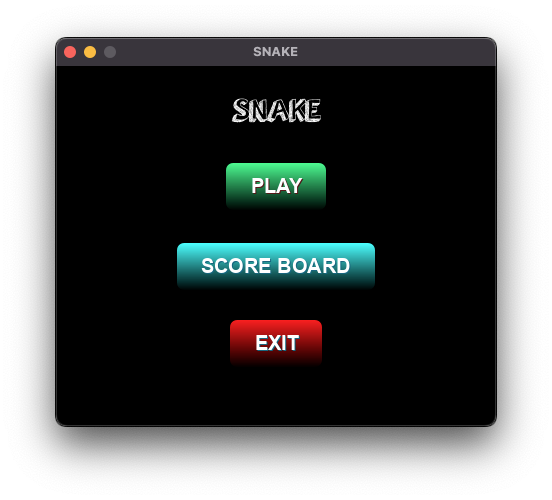
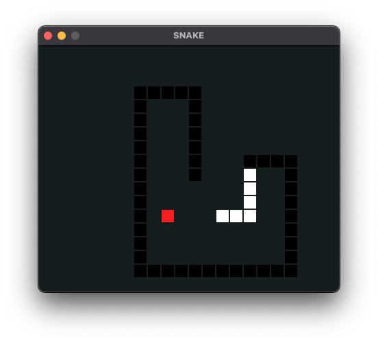
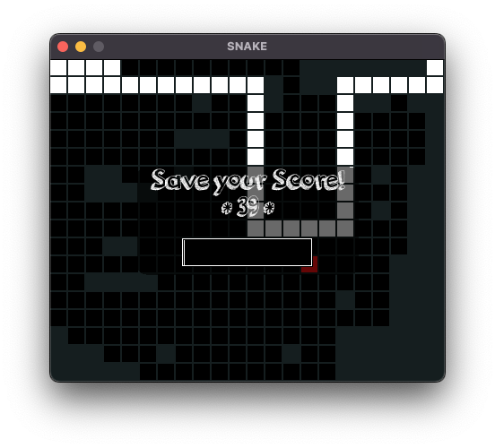

# RED - SNAKE

## Rövid leírás

A SNAKE egy klasszikus kígyós játék, amelyben a felhasználó egy növekvő kígyót irányít a képernyőn, és almákat gyűjt. A játék célja, hogy minél több almát gyűjtsön, és ezzel minél magasabb pontszámot érjen el, kerülve a falnak vagy a kígyó saját testének az ütközést.

## Funkciók

- Egyszerű és intuitív irányítás a nyílbillentyűkkel
- Pontgyűjtés almák megszerzésével
- Dicsőség lista a legmagasabb pontszámokkal
- Játékmenet szüneteltetése és folytatása

## Képernyőképek

|  |  |  |
|:---:|:---:|:---:|
|  |  |  |

## Használat

1. Indítsd el a játékot.
2. A menüben válaszd az 'Új játék' opciót a játék indításához.
3. Irányítsd a kígyót a nyílbillentyűkkel, és gyűjtsd az almákat.
4. Kerüld el, hogy a kígyó a falnak vagy a saját testének ütközzön.
5. A játék végén írd be a neved a Dicsőség listára kerüléshez.

## Licenc

Ez a projekt MIT licenc alatt áll - lásd a [LICENSE](LICENSE) fájlt a részletekért.
